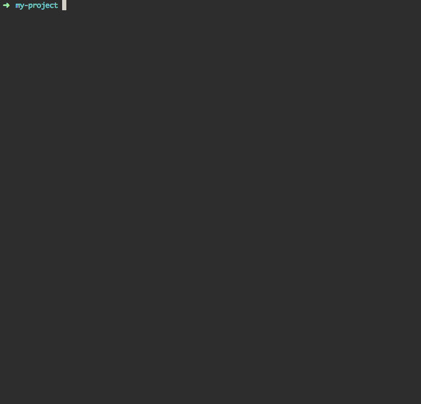
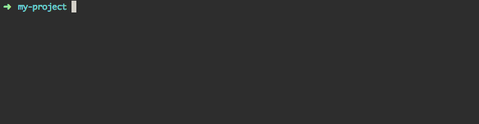

Getting started
===============

npm is the package manager and command line utility for JavaScript and NodeJS. If you've installed node, you will also have npm. Let's start a project!

## Init'ing a project

Every node project should have a `package.json` file. This file stores information about the project including its authors, license information and, most importantly, its dependencies. The `npm init` command makes creating this file very easy.

First, create a new folder and `cd` into it. 

```shell
mkdir my-project
cd my-project
```

Then do:

```shell
npm init
```

This will give you an interactive prompt to help you fill out your project information.



As it prompts you for information, the value in parenthese is the default. If you hit <kbd>return</kbd>, this value will auto-fill.

**Note:** In the above example, we've left the repository field blank. If we had already run `git init` and connected our project to a GitHub repo, this value would auto-fill. For this reason, it's a good idea to run `npm init` *after* you run `git init` and connect it to GitHub.

## Installing dependencies

When you want to use an external library, like underscore, instead of downloading that file manually, you can use the `npm install <package name>`.

Let's try that with Underscore:

```shell
npm install underscore
```



The install process addded a `node_modules` folder and inside of that, it installed our undscore library.

**Note:** After installing, any time you see a tree structure displaying module names with their version number, you can breath easy knowing that the installation went smoothly.

**Note2:** If you're using npm version 2, you will see a spinning line instead of a progress bar. You also won't see the `extraneous` label, more on that later.

## Saving dependencies (best practice)

Now, you would think that doing `npm install <package name>` is the correct way of doing things, especially since 90 percent will tell you to do exactly this. However, we said before that one of the most important duties of `package.json` is to keep track of your dependencies. If you open up that file, you'll notice that the `dependencies` field is still empty!

Saving a dependency to your `package.json` is extremely important because we don't check in our `node_modules` folder to GitHub. If anyone wants to clone down a repository, they will need to install its dependencies for themselves. They only way they can do this is if your dependency list is saved.

To install a dependency **and** have that saved to your `package.json` use the `--save` flag like so:

```shell
npm install --save underscore
```


Very handily, the version number is automatically saved in our `package.json`.

You'll notice that by installing with `--save` we've gotten rid of the `extraneous` label. That marker tells us that we have a module installed that isn't tracked in `package.json`. 

**Note:** npm added a `^` before our version number. This means that when someone installs this project's dependencies, it can install the highest version in the 1.x.x branch.

For example, if version 1.9.2 is available, that will be installed. If version 2.0.0 is available, it will not install because we wanted to keep the major version fixed. Here's [more info](https://docs.npmjs.com/getting-started/semantic-versioning) from npm on different versioning options.

## Installing a project's dependencies

Generally you'll be cloning down someone elses project and installing their dependencies. To do that, use `npm install`.

Push your project to GitHub and then, in another folder, clone it down and install its dependencies.

```shell
git clone https://github.com/<your-github-username>/my-project
cd my-project
npm install
```
If you see the tree directory, then it's all good!
