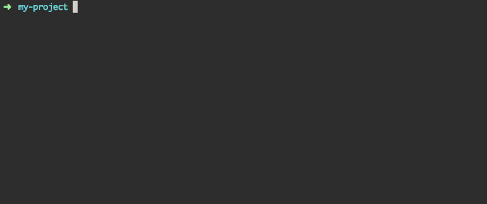

Run commands
============

One of the great things about npm is its ability to run tasks for you similar to a make file. For example, if your project is to scrape a website, you could say `npm start` and it will execute a list of commands in the proper order.

This workflow is nice because it means all of your projects can be started with the same command so you don't have to remember things like "Do I run the download.js script and then the fetch.js or vice versa?" When you come to an old project, it can follow consistent conventions like `npm start` or `npm run dev`.

## Specifying run commands

From your previous step, your `package.json` should look like this:

```json
{
  "name": "my-project",
  "version": "1.0.0",
  "description": "My cool project.",
  "main": "index.js",
  "scripts": {
    "test": "echo \"Error: no test specified\" && exit 1"
  },
  "author": "Michael Keller",
  "license": "MIT",
  "dependencies": {
    "underscore": "^1.8.3"
  }
}
```

Let's create a new file called `index.js` and have it print "Hello, World."

```shell
touch index.js
echo "console.log('Hello, World')" > index.js
```

Test this by running `node index.js`


Add the following to your `package.json` as the first item in `scripts`:

```
"start": "node index.js",
```

Your `package.json` should look like the following:

```json
{
  "name": "my-project",
  "version": "1.0.0",
  "description": "My cool project.",
  "main": "index.js",
  "scripts": {
    "start": "node index.js",
    "test": "echo \"Error: no test specified\" && exit 1"
  },
  "author": "Michael Keller",
  "license": "MIT",
  "dependencies": {
    "underscore": "^1.8.3"
  }
}
```

Now do `npm start`



You'll notice it does the same thing but adds a bit of information about the task such as the project name, its version and the command it runs. If for some reason you want to hide this, append `--silent` to your command such as:

```shell
npm start --silent
```

### Custom run commands

The script commands `start` and `test` are special cases in that they can be run by simply doing `npm <command name>`

Any custom commands added to the `scripts` hash are run via `npm run <command name>`.

These scripts need not be Node scripts, either. They can be anything that you would type onto the command line. For example, let's make one that runs `ls`.

With a `package.json` of the following, do `npm run list-files`

```json
{
  "name": "my-project",
  "version": "1.0.0",
  "description": "My cool project.",
  "main": "index.js",
  "scripts": {
    "list-files": "ls",
    "start": "node index.js",
    "test": "echo \"Error: no test specified\" && exit 1"
  },
  "author": "Michael Keller",
  "license": "MIT",
  "dependencies": {
    "underscore": "^1.8.3"
  }
}
```

### Command line dependencies

As we saw in the **Saving dependencies** section of `1-getting-started.md`, you can keep track of your dependencies by doing `npm install --save <pkg-name>`. This command will download the specified library into the `node_modules` folder and add a reference to its name and version in `package.json` and you have access to that package in your scripts via `var myPackage = require(<pkg-name>)`.

Some node packages are meant to be used on the command line, though. Fortunately, the process is exactly the same for these and run scripts give you some nice conveniences as well.

For example, let's say you use the [live-server](https://www.npmjs.com/package/live-server) package to create a local server that will automatically refresh when your files change. You've installed this node module globally with `npm install -g live-server` which means that you can type `live-server` into any terminal window and it will start a local server.

Now, a colleague wants to clone down your project and get it running with a local server, This can be a stumbling block if a) they don't already have live-server (or some other solution) installed, or b) your project has some specific settings to make the server run smoothly.

As a solution, you can do `npm install --save live-server`, which will create a `node_modules/.bin` folder and put a live-server executable there. All of your commands in your `package.json` run scripts, will look for executable files in this folder. You can now add a run command (we'll call it `server` that will run that executable like so:

```json
{
  "name": "my-project",
  "version": "1.0.0",
  "description": "My cool project.",
  "main": "index.js",
  "scripts": {
    "start": "node index.js",
    "test": "echo \"Error: no test specified\" && exit 1",
    "server": "live-server"
  },
  "author": "Michael Keller",
  "license": "MIT",
  "dependencies": {}
}
```

A user can launch the server with `npm run server`. This makes it convenient since your package is fully self-contained.

This setup is also a good practice for command-line packages like [Gulp](http://gulpjs.com/) because it makes it clear what version you are using. There are also consistency benefits in that if you want to switch from live-server or Gulp to something else, your users can keep using the same generic `npm run server` commands or `npm run build`.

### Advanced run commands

You can get fancy with run commands. In the list below, we have `do-all` which runs our other npm commands.

```json
{
  "name": "my-project",
  "version": "1.0.0",
  "description": "My cool project.",
  "main": "index.js",
  "scripts": {
    "do-all": "npm start && npm run list-files",
    "list-files": "ls",
    "start": "node index.js",
    "test": "echo \"Error: no test specified\" && exit 1"
  },
  "author": "Michael Keller",
  "license": "MIT",
  "dependencies": {
    "underscore": "^1.8.3"
  }
}
```

Similar to make files, you can also add post and pre hooks. In the file below, if we ran `npm start`, it would first run the command under `prestart` and when `start` finished, it would run `poststart`.

```json
{
  "name": "my-project",
  "version": "1.0.0",
  "description": "My cool project.",
  "main": "index.js",
  "scripts": {
    "prestart": "echo 'Getting ready to start...",
    "start": "node index.js",
    "poststart": "echo 'Finished!",
    "test": "echo \"Error: no test specified\" && exit 1"
  },
  "author": "Michael Keller",
  "license": "MIT",
  "dependencies": {
    "underscore": "^1.8.3"
  }
}
```

## Further reading

There are bunch of other neat tricks. Here is some more info on [npm scripts](https://docs.npmjs.com/misc/scripts) and running [custom scripts](https://docs.npmjs.com/cli/run-script).
